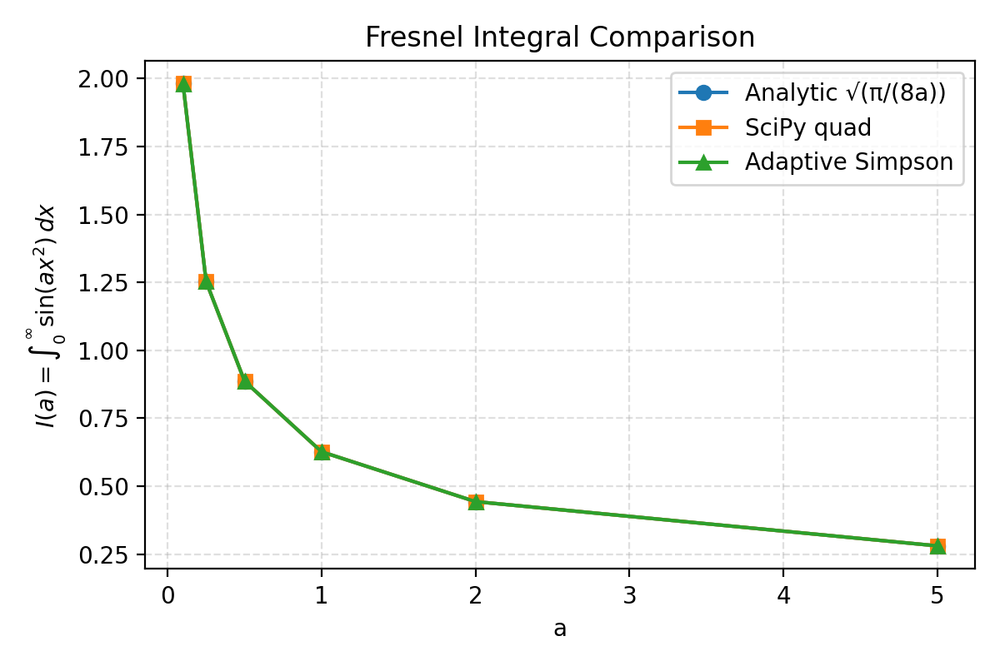

# Slack Codex Tests Repository Overview

This repository is a grab bag of two unrelated projects that live side-by-side:

1. **A calculus practice final** with fully worked, blue-font solutions intended for LaTeX compilation.
2. **A Fresnel integral benchmarking script** that compares analytic, SciPy, and adaptive Simpson evaluations of \(I(a) = \int_0^\infty \sin(a x^2)\,dx\).

Rather than forcing these into a single narrative, this README briefly documents each area so you can navigate directly to what you need.

---

## Repository Map

| Path | Purpose |
| --- | --- |
| `calculus-hw/` | LaTeX source (`practicefinal.tex`) and compiled PDF (`practicefinal.pdf`) for a multisection calculus practice final, complete with detailed solutions. |
| `compute_integral.py` | Python script that sweeps several scale factors \(a\), evaluates the Fresnel sine integral with multiple techniques, prints a comparison table, and renders a summary plot. |
| `assets/fresnel_comparison.png` | Plot produced by `compute_integral.py`, showing how the analytic result lines up with the numerical integrations. |

---

## Calculus Practice Final (`calculus-hw/`)

The LaTeX document walks through a full-length practice final exam. Key points:

* **Color-coded answers:** Solutions are highlighted in blue (via the `xcolor` package) for quick scanning when the PDF is rendered.
* **Fully worked reasoning:** Each problem includes the same level of detail you would expect from an advanced undergraduate—continuity, asymptotics, Mean Value Theorem applications, limits, polynomial analysis, logistic linearization, Riemann sums, and trigonometric integration are all covered.
* **Ready to compile:** Run `pdflatex practicefinal.tex` (twice for cross-references) to regenerate `practicefinal.pdf`. No external assets are required.

If you need to adjust the styling or tailor the questions, edit `practicefinal.tex` directly; the PDF will update on the next compile.

---

## Fresnel Integral Sweep (`compute_integral.py`)

This standalone script targets the oscillatory integral

\[
I(a) = \int_0^\infty \sin(a x^2)\,dx = \sqrt{\frac{\pi}{8a}} \quad (a > 0).
\]

Highlights:

* **Multiple evaluation strategies:**
  * Closed-form analytic value for reference.
  * `scipy.integrate.quad` with a sine weight, which handles oscillatory integrals efficiently.
  * A handcrafted adaptive Simpson routine with an asymptotic tail correction.
* **Comparison output:** Prints a table summarizing discrepancies between each numerical approach and the closed form.
* **Plot generation:** Saves a comparison plot to `assets/fresnel_comparison.png` (shown below) to visualize agreement across \(a\) values.

To run the sweep locally:

```bash
pip install scipy matplotlib
python compute_integral.py
```

The script writes the plot and prints the table to stdout; no additional configuration is needed.



---

## Tips for Extending the Repo

* Keep additions isolated—mirroring the current "two projects in one" structure makes it easy to reason about each artifact independently.
* If you add more computational experiments, drop their outputs into `assets/` and reference them from the README or a dedicated markdown file.
* For LaTeX edits, remember to include any new package requirements at the top of `practicefinal.tex` to keep compilation smooth for others.

Feel free to adapt either portion of the repository as needed—the README is meant as a roadmap, not a constraint.
